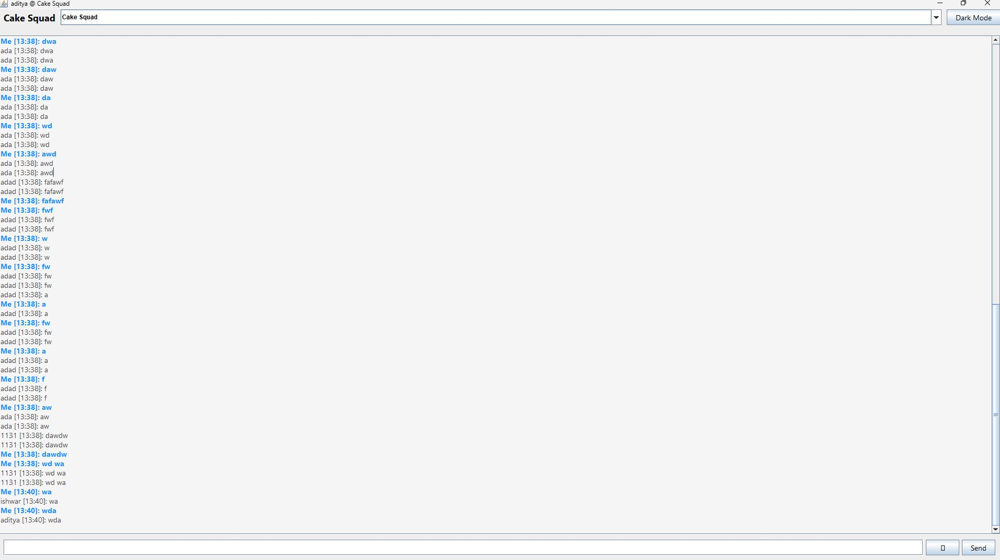
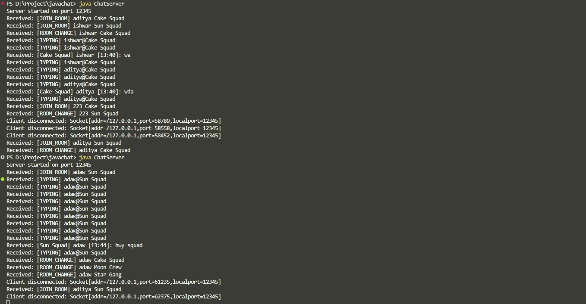

# Java Group Chat Application

A simple real-time group chat application built in Java using sockets with a Swing GUI client and a multi-threaded server.  
Supports multiple chat rooms, dark mode, emoji input, typing indicators, and persistent chat history.

---

## Features

### Client
- User-friendly Swing GUI with:
  - Multi-room chat selection (e.g. Sun Squad, Cake Squad)
  - Dark mode toggle
  - Emoji picker
  - Typing indicators
  - Persistent chat history saved per room locally
  - System Tray integration
- Real-time message sending and receiving over TCP sockets.
- Clean message formatting with timestamps and usernames.

### Server
- Multi-threaded TCP server handling multiple clients concurrently.
- Supports multiple chat rooms — messages are broadcast only to clients in the same room.
- Handles user join, leave, room change, and typing notifications.
- Simple text protocol with clear message formatting for clients.
- Robust connection handling and client management.

---

## Getting Started

### Prerequisites

- Java 8 or above installed on your system.
- Basic knowledge of running Java applications from command line.

### Running the Server

1. Compile the server code:

```bash
javac ChatServer.java
````

2. Run the server:

```bash
java ChatServer
```

The server will listen on port `12345` by default.

---

### Running the Client

1. Compile the client UI:

```bash
javac ChatClientUI.java
```

2. Run the client:

```bash
java ChatClientUI
```

3. When prompted:

   * Enter your username.
   * Select a chat room.
4. Start chatting!

---

## Project Structure

📁 Project Root
│
├── ChatServer.java           # Main server class to accept clients and handle communication
├── ChatClientUI.java         # Swing-based client GUI application
├── ClientHandler.java        # Threaded handler for each connected client (used by server)
├── README.md                 # Project documentation and setup instructions
│
├── 📁 images/                # Folder containing screenshots used in README
│   ├── chat1.jpg             # Light mode screenshot
│   ├── chat2(dark).jpg       # Dark mode screenshot
│   └── ClipentLog.jpg        # Client log terminal output
│
└── history_<roomname>.txt    # Auto-generated chat logs (e.g., history_Sun_Squad.txt)

---

## Communication Protocol

Messages between client and server use a simple text-based format with clear prefixes and delimiters:

* **User join room:**
  `[JOIN_ROOM] username room`

* **Typing notification:**
  `[TYPING] username@room`

* **Room change:**
  `[ROOM_CHANGE] username room`

* **Chat message:**
  `[ROOM_NAME] username [HH:mm]: message text`

Clients only display messages matching their current room.

---

## How it works

* The server listens for client connections and spawns a thread per client.
* Each client registers a username and room.
* When a client sends a message, the server broadcasts it only to clients in the same room.
* The client UI updates chat area, shows typing indicators, saves history, and supports theme toggling.

---

## Contribution

Feel free to open issues or submit pull requests to improve features or fix bugs.

---

## License

MIT License © 2025 Your Name

---

## Contact

* GitHub: [adityasync](https://github.com/adityasync)
* Email: [adityabuilds@outlook.com](mailto:adityabuilds@outlook.com)

---

## Screenshots

### Light Mode Chat Window



### Dark Mode Chat Window

.jpg)

### Client Log Window



---

*Enjoy chatting with your squad! 🚀*
